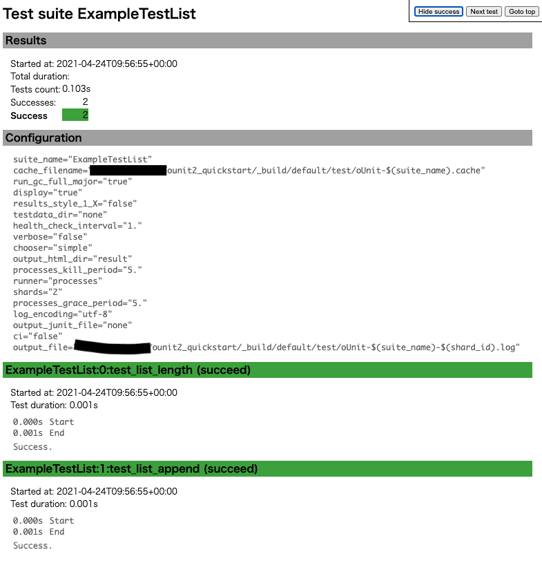

OUnit2 Quickstart with dune [](https://travis-ci.org/mamewotoko/ounit2_quickstart)
===========================



Setup
-----
1. install opam2
2. install odoc and ounit2

    ```
    sh setup-opam
    ```

Build and run Test
------------------

### method1: console output

```
dune runtest
```

Example output

```
> dune runtest test
dune runtest test
   test_list alias test/runtest
..
Ran: 2 tests in: 0.11 seconds.
OK
```

### method2: HTML output
1. set OUNIT_OUTPUT_HTML_DIR and run test

```
mkdir -p reuslt
OUNIT_OUTPUT_HTML_DIR=result dune runtest
```

2. HTML report will be saved as a file `./_build/default/test/result/index.html`

Example Test Detail
---------------------

2 kinds of tests

* Test in a directory `test`
* Inline test: 
  * ppx_inline_test `src`
  * TODO qtest 
  * TODO ppx_expect

TODO
-----

* measure code coverage with [bisect_ppx](https://github.com/rleonid/bisect_ppx)
* junit test report? (xml format)

References
------------
* [OUnit - xUnit testing framework for OCaml](https://github.com/gildor478/ounit)
* [src/test_list.ml](src/test_list.ml) is copied from <https://github.com/gildor478/ounit/blob/master/examples/test_list.ml>
* [Writing and running tests — dune documentation](https://dune.readthedocs.io/en/stable/tests.html)

----
Takashi Masuyama < mamewotoko@gmail.com >  
https://mamewo.ddo.jp/
